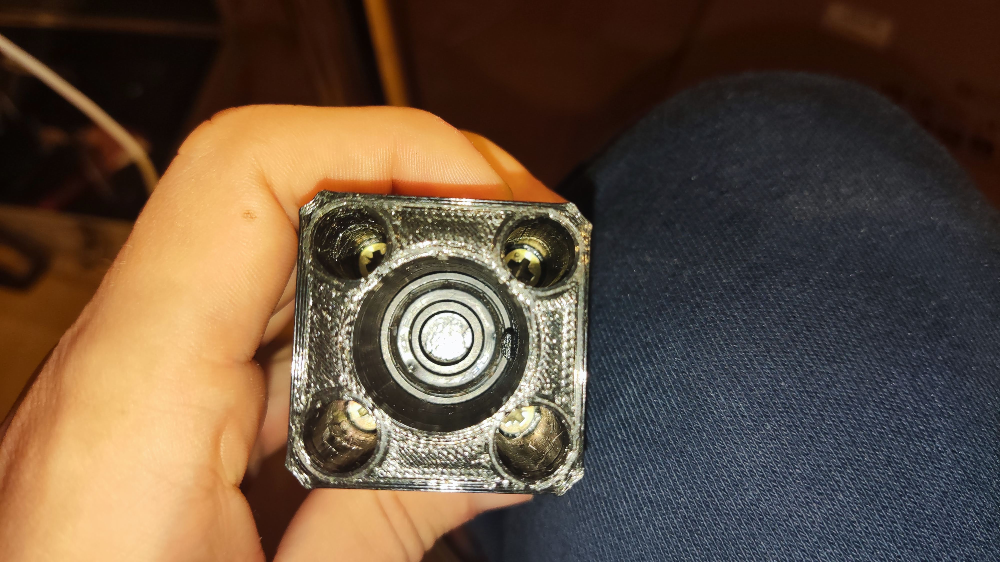
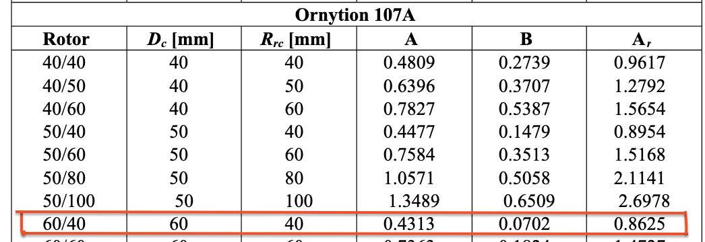

# Anemometer V1

The anemometer V1 is a fully open source hand held wind speed measuring device intended for low accuracy applications.

  
  &nbsp
  

If you have a 3d printer everything else needed to build this device is commonly available.

Check out the demo video:

Measured wind speed (not average wind speed) was varying from $2.66m/s$ to $6.54m/s$, mostly it was showing $3.95 m/s$ or $5.25m/s$. I think the results are acceptable because there were definitely some lulls and gusts and the wind speed wasn't averaged.

Actual **average wind speed** at the time of measuring was about $5.8 m/s$  
Source:

- https://monitor.protezionecivile.fvg.it/#/misure/69/6
- Time of measuring: 24.09.2022 @13:56.
- Location: Grado, Italy

## Parts List

| Part                                   | Quantity                                             | Link                                                                                                                                                                                        |
| -------------------------------------- | ---------------------------------------------------- | ------------------------------------------------------------------------------------------------------------------------------------------------------------------------------------------- |
| (3x3) mm neodymium magnet              | 3                                                    | https://neodim-magneti.si/shop/neodim-magneti/okrogli-magneti/magneti-neodim-3-x-3-mm-okrogli/                                                                                              |
| 8mm aluminum shaft                     | 1                                                    | ...                                                                                                                                                                                         |
| 607zz bearing                          | 2                                                    | ...                                                                                                                                                                                         |
| ESP32 devboard                         | 1                                                    | https://www.aliexpress.com/item/4000090521976.html?10000012530088478                                                                                                                        |
| TLE4905L hall effect sensor (switcher) | 1 (it's easy to break the legs so maybe order a few) | https://www.ic-elect.si/ic-tle4905l-to-92slim-switcher.html                                                                                                                                 |
| Self drilling screw                    | 4                                                    | I used Ø4mm, 3cm long ones I found at home. Something like [this](https://si.farnell.com/tr-fastenings/4-2-x-22-kpa2dx-s50-din7504/countersunk-head-screw-ss-4-2mm/dp/3442592) should work. |

## Overview (Basic functioning principle)

The wind drives the cups and causes the shaft to rotate at a speed proportional to the wind speed. Three magnets are mounted around the shaft and a [hall effect sensor](https://en.wikipedia.org/wiki/Hall_effect_sensor) detects each time a magnet passes by. Based on the number of pulses, wind speed can be calculated.

## Overview (hardware)

### Body

The body is composed of two parts.
The lower part is bigger and stores the esp32 and battery. On the side it has a canal for cable routing.
The upper part serves as a mounting point for the two 607zz bearings into which the shaft is inserted. (one bearing at the bottom and one on top)  
It also has a canal on the side for the hall effect sensor it's cables.  
The two parts are connected with 4 screws.

  
  &nbsp
  
  

  
  &nbsp
  

### Cups

The cups are modeled after the conical 60/40 cups in this paper: https://www.researchgate.net/publication/229017042_On_Cup_Anemometer_Rotor_Aerodynamics

  
  &nbsp
  

They are printed individually and then super glued to a 3d printed tube that slides onto the aluminum shaft.

  
  &nbsp
  

### Magnets

The three magnets are placed and glued on a holder that is then slid onto the shaft.  
It is important to orient the magnets correctly so the sensor can detect them. (Hall effect sensor is sensitive to the direction of the magnetic field)

  
  &nbsp
  
  

### Electronics

The 4905L hall effect sensor has $3$ pins, $Vs\space (power),\space GND,\space Q\space (output)$. A pull up resistor is connected between $Vs$ and $Q$. When a magnet passes by the sensor pulls the $Q$ pin low.  
The sensor output $Q$ is connected to $GPIO\space 27$ on the ESP32 devboard. $GPIO\space 26$ is connected to $LOW$ as it is a control pin for the counter that is used to count rotations per second. $GPIO\space26 = LOW$, means the counter is enabled (counts).
$Vs$ is connected to $5V$ and $GND$ is connected to ground.

## Overview (software)

### Firmware

The firmware is written in C and uses the esp-idf framework.  
It handles detection of rotations per second based on the sensor input, then calculating wind speed based on that. To expose data to the client application it uses a Bluetooth Low Energy GATT server.

To detect rotations per second, a counter is configured on GPIO27 to count on falling edge with a max count of $3$.
When max count is reached a full rotation has completed (because there are three magnets around the shaft), an interrupt is triggered. The interrupt handler queues a task to increment the `current_second_rotations` variable (variable that stores how many times the shaft has rotated in currently ongoing second). It is important to use a freeRTOS task queue to avoid blocking other processes and triggering the watchdog. (https://stackoverflow.com/questions/66278271/task-watchdog-got-triggered-the-tasks-did-not-reset-the-watchdog-in-time)
All tasks in the queue get processed before the **timer** interrupt is triggered. The timer interrupt triggers every second, it assigns `current_second_rotations` to the `rotation_frequency` variable (rotations/second) and resets the `current_second_rotations` variable.

Once we have the `rotation_frequency` we can calculate the wind speed using the formula:

$$ V = A f + B $$

... where $A$ and $B$ are calibration coefficients, $V$ is wind speed and $f$ is the anemometer's _rotation frequency output_ (**not rotation frequency**).  
$A$ and $B$ are normally determined experimentally in a wind tunnel. But since we are using this device for low accuracy applications we use the coefficients from Ornytion 107A anemometer when it's used with 60/40 cups (that's what the cups are modeled after).

https://www.researchgate.net/publication/259530558_Aerodynamic_Analysis_of_Cup_Anemometers_Performance_The_Stationary_Harmonic_Response

To expose data to the client application a Bluetooth Low Energy GATT server is set up.
As seen in the chart above, the GATT server has an Anemometer profile with a wind speed service that exposes the wind speed characteristic as READ only.

  

The firmware also configures BT LE GAP for advertising.
If you want to learn about BT LE GATT and GAP I recommend reading these two articles:

- https://learn.adafruit.com/introduction-to-bluetooth-low-energy/gap
- https://learn.adafruit.com/introduction-to-bluetooth-low-energy/gatt

If you want to include BT LE with esp-idf in your own projects there are examples available in the esp-idf repository:

- https://github.com/espressif/esp-idf/blob/82cbcf893a/examples/bluetooth/bluedroid/ble/gatt_server_service_table/tutorial/Gatt_Server_Service_Table_Example_Walkthrough.md
  This article also helped me a lot to clear a few things up:
- https://atadiat.com/en/e-all-about-esp32-part-4/

### Mobile app

The app is written in dart (flutter).  
It serves as the BT LE client for the anemometer and displays the wind speed.
The [flutter_blue_plus](https://pub.dev/packages/flutter_blue_plus) package does all the heavy lifting for you.

  
  &nbsp
  

## How to build and run

### Firmware

- Install _esp-idf_:
  - [Windows](https://docs.espressif.com/projects/esp-idf/en/latest/esp32/get-started/windows-setup.html)
  - [Linux/MacOS](https://docs.espressif.com/projects/esp-idf/en/latest/esp32/get-started/linux-macos-setup.html)
- Open a terminal (needs to have `idf.py` available) and navigate to the firmware directory
- Connect board to computer
- RUN `idf.py flash`

### Mobile app

- Install flutter
- Navigate to the app directory
- RUN `flutter build apk && flutter install` or `flutter run` if you only want to run it and not install.

## What's next

I want to create Anemometer V2, which will be a more compact and an all around better version of this one.

### Goals for V2:

- Custom PCB with a much smaller footprint
- Smaller cups and shaft setup with less resistance.
  - Also put a cage around the cups so you can throw this device in a backpack and not worry about it.
- Maybe move to a different platform (ESP32 seems to be overkill for this application)
- Add battery and charging circuit (USB C)
